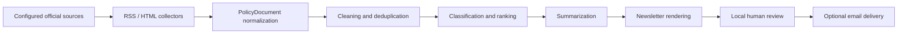

# PolicyBrief G2C

PolicyBrief G2C is a Python-based MVP for collecting official Korean government policy materials, turning them into citizen-friendly summaries, and generating review-ready HTML newsletters or policy briefing reports.

The project is designed for a Government-to-Citizen workflow: official source material goes in, traceable plain-language summaries come out. Email delivery is intentionally disabled by default.

## What It Produces

- A local HTML newsletter for human review
- A plain-text version of the same issue
- Structured policy document records with source attribution
- Citizen-focused summaries with eligibility, application method, impact, dates, and original links when they can be identified from the source

Every generated report or newsletter item keeps the original title, agency, publication date, canonical URL, collection timestamp, and processing metadata.

## Reference Sources For Reports

The MVP does not hard-code live government scraping targets. By default, `policybrief run --demo` uses offline fictional fixtures so the repository works without network access or API keys.

For production, reports should be generated only from explicitly configured official sources in `config/sources.example.yaml` or a private source configuration file. Recommended source categories are:

| Source type | Example official source | Intended use |
| --- | --- | --- |
| Central policy portal | `https://www.korea.kr/` | Policy news, press releases, briefing room materials, policy archives, explanatory documents |
| Korea.kr press releases | `https://www.korea.kr/briefing/pressReleaseList.do` | Cross-ministry press releases and official announcements |
| Korea.kr policy news | `https://www.korea.kr/news/policyNewsList.do` | Policy news written for the public |
| Korea.kr expert/archive documents | `https://www.korea.kr/archive/expDocMainList.do` | Longer policy documents and reference materials |
| Korea.net press releases | `https://www.korea.net/Government/Briefing-Room/Press-Releases` | English-language official Republic of Korea press releases |
| Public Data Portal | `https://www.data.go.kr/` | Open datasets and Open APIs from Korean public institutions |
| Ministry press rooms | Example: `https://www.mofa.go.kr/eng/brd/m_5676/list.do` | Ministry-specific announcements where source-specific adapters may be useful |
| Ministry RSS pages | Example: `https://www.mofa.go.kr/eng/wpge/m_20360/contents.do` | RSS-based collection where an official feed is available |

Operational rule: the generated report must be based only on collected official source text. The summarizer must not add eligibility, deadlines, benefits, procedures, or claims that are absent from the original source.

Before enabling any live source, verify:

- The domain is an official government or public institution domain.
- The URL, selectors, feed URL, and pagination rules still match the current site.
- The site terms, robots policy, copyright/reuse conditions, and public-sector reuse rules allow the intended collection.
- The source can be collected gently with timeouts, retries, request delays, and domain allowlisting.

## Key Features

- Generic RSS collector
- Configuration-driven HTML collector
- Pydantic schemas for `PolicyDocument` and `NewsletterIssue`
- SQLite repository with idempotent writes
- Text cleaning and normalization
- Exact and near-duplicate detection with `rapidfuzz`
- Keyword-based policy classification
- Transparent importance scoring
- Offline extractive summarization
- Optional OpenAI-compatible LLM summarization with extractive fallback
- Jinja2 HTML and text newsletter rendering
- SMTP sender abstraction with safe defaults
- Typer CLI
- Pytest, Ruff, Mypy, and GitHub Actions configuration

## Architecture



## Installation

```bash
python -m venv .venv
.venv\Scripts\activate
python -m pip install -U pip
python -m pip install -e ".[dev]"
```

On macOS or Linux:

```bash
python -m venv .venv
source .venv/bin/activate
python -m pip install -U pip
python -m pip install -e ".[dev]"
```

## Run The Offline Demo

```bash
policybrief run --demo
```

The demo loads local fictional policy materials from `tests/fixtures/`, processes them, generates summaries, and writes the newsletter under `data/newsletters/`.

No live website, external API key, or SMTP account is required.

## CLI

```bash
policybrief collect
policybrief process
policybrief summarize
policybrief build-newsletter
policybrief preview
policybrief send --dry-run
policybrief run --demo
policybrief validate-config
policybrief show-stats
```

## Configuration

Copy `.env.example` to `.env` and adjust local settings as needed.

Important settings:

- `SOURCE_CONFIG_PATH`: YAML file containing official source definitions
- `CATEGORY_CONFIG_PATH`: keyword category configuration
- `DATABASE_PATH`: local SQLite path
- `OUTPUT_DIR`: newsletter output directory
- `SUMMARY_PROVIDER`: `extractive` or `llm`
- `EMAIL_SEND_ENABLED`: must remain `false` unless real sending is intentionally configured

Do not commit real API keys, SMTP credentials, subscriber lists, generated newsletters, raw production data, or local databases.

## Optional LLM Summarization

The default summarizer works offline. To enable an OpenAI-compatible provider:

```env
SUMMARY_PROVIDER=llm
LLM_ENABLED=true
LLM_API_KEY=...
LLM_BASE_URL=https://api.openai.com/v1
LLM_MODEL=...
```

Collected source text is treated as untrusted data. The LLM prompt explicitly separates source content from instructions and requires structured JSON validated by Pydantic. If the LLM call or validation fails, the pipeline falls back to the extractive summarizer.

## Optional SMTP Delivery

Real email delivery is disabled by default.

```env
SMTP_HOST=
SMTP_PORT=587
SMTP_USERNAME=
SMTP_PASSWORD=
SMTP_FROM=
EMAIL_SEND_ENABLED=false
```

Real sending requires both `EMAIL_SEND_ENABLED=true` and the CLI `--confirm-send` flag. Recipient lists must come from local ignored files or environment variables, not from Git.

## Quality Checks

```bash
ruff check .
ruff format --check .
mypy src
pytest --cov=policybrief_g2c
```

## Repository Structure

```text
config/                 Source and category configuration
data/                   Local runtime data, ignored except .gitkeep files
docs/                   Architecture, schema, source, and operations notes
src/policybrief_g2c/    Application package
tests/                  Offline tests and fixtures
```

## Safety Principles

- Official-source-first collection
- Domain allowlisting
- Request timeout, retry, and delay controls
- Source traceability for every summary
- HTML escaping in rendered output
- No fabricated eligibility, benefits, deadlines, or application procedures
- No credentials or subscriber lists in Git
- Email sending disabled by default
- Human review before delivery

## Disclaimer

PolicyBrief G2C generates automated summaries from official public materials. The original publication is the authoritative source. Details may change after collection. Users should verify eligibility, deadlines, application procedures, and legal requirements through the original source or responsible agency.
